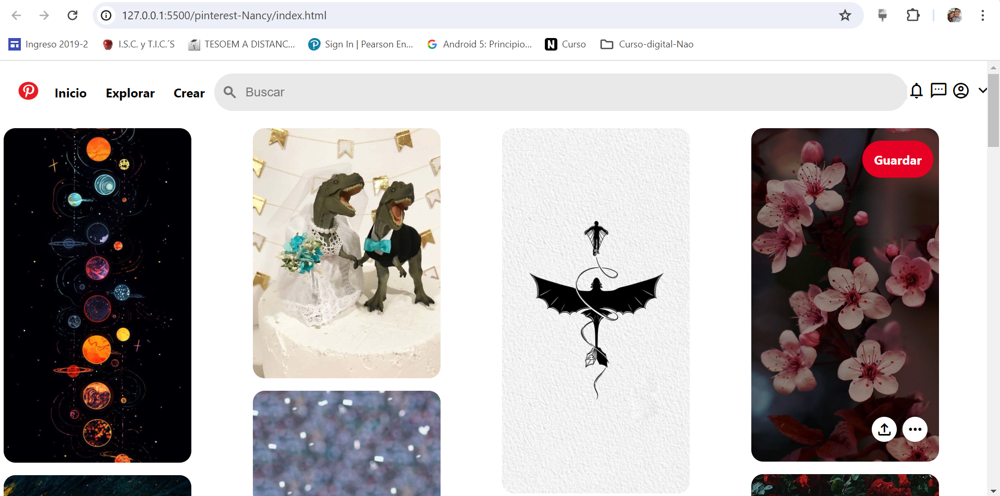

# Clon de Pinterest con HTML y CSS 
Este proyecto es un clon de la interfaz de usuario de Pinterest ,creado puramente con HTML5 y CSS3.

Se enfoca en replicar la apariencia visual de Pinterest,ofreciendo una experiencia de navegación similar con un diseño responsive y funcionalidades básicas.

### Características 

* **Diseño Responsive:** Adaptable a diferentes tamaños de pantalla para una experiencia de usuario óptima en dispositivos móviles y de escritorio.
* **Interfaz de usuario Intuitiva:** Inspirada en Pinterest ,coun una navegación fácil y accesible.
* **Interacciones Dinámicas:** Efectos visibles para elementos interactivos con botones y enlaces.
* **Iconografía y Estilos modernos:** Uso de la biblioteca de iconos de material Desing y estilos CSS.😊

### Tecnologías Utilizadas 
+ **HTML5:** Para la estructura básica del sitio.
+  **CSS3:** Para el diseño y estilo, incluyendo _flexbox_ para un diseño responsive y efectos de _hover_
+  **Google Fonts:** Para fuentes personalizadas.

### Vista Previa del Proyecto

### Contacto
SI te gustaria colaborar en un proyecto , escribime por [LinkedIn](www.linkedin.com/in/mariana-aguilar-s)

  
